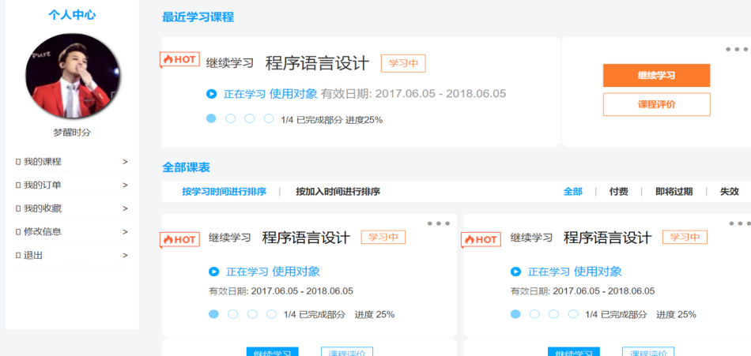
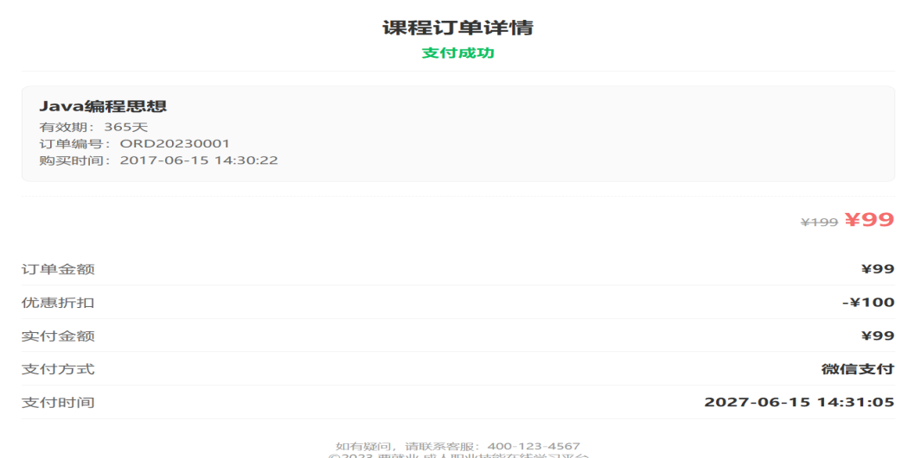
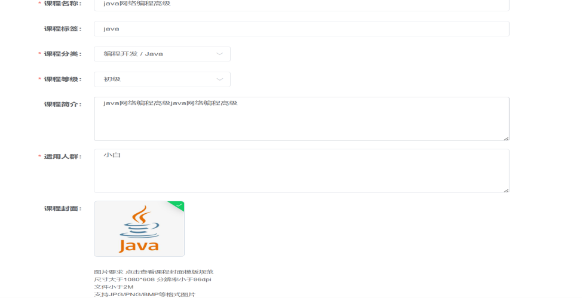
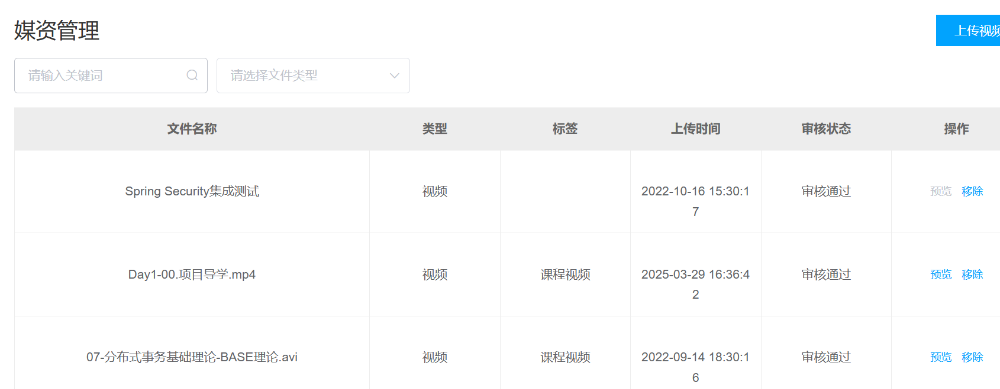

<h1 align="center">Vocational Learning Platform</h1>

<p align="center">
  
  
  
  
  
  
  
  
</p>

A Spring Cloud–based online vocational skills learning platform for adult learners, designed to support course publishing, media management, authentication, online learning, order workflows, and institution-side operations in a microservices architecture.

---

## Table of Contents

- [Project Overview](#project-overview)
- [Core Features](#core-features)
- [Technical Highlights](#technical-highlights)
- [Tech Stack](#tech-stack)
- [Architecture](#architecture)
- [Project Structure](#project-structure)
- [Business Modules](#business-modules)
- [Getting Started](#getting-started)
- [Configuration](#configuration)
- [Run the Project](#run-the-project)
- [API Testing](#api-testing)
- [Screenshots](#screenshots)
- [Development Notes](#development-notes)
- [Future Improvements](#future-improvements)
- [License](#license)

---

## Project Overview

This project is an **online vocational learning platform** built for adult learners and training institutions.  
It adopts a **frontend-backend separated** architecture, with **Vue.js** on the frontend and **Spring Cloud microservices** on the backend.

The platform is centered around two major business domains:

- **Learner side**: authentication, course browsing, course purchase, online learning, and personal schedule management
- **Institution side**: course publishing, content management, media asset administration, and operational support

The system is designed for real-world online education scenarios such as fragmented learning, video-based teaching, content operations, and order/payment workflows.

---

## Core Features

### Learner Side
- User registration and login
- Token-based identity authentication
- Third-party login integration
- Course browsing and searching
- Course purchase and order flow
- Online video learning
- Personal timetable / learning schedule
- Order status query and timeout handling

### Institution Side
- Institution authentication and access control
- Course content management
- Media asset management
- Course publishing and maintenance
- Teacher / lecturer management
- Operational resource management

### Platform Capabilities
- Authentication and authorization
- Distributed file upload and media storage
- Video transcoding workflow
- High-performance caching
- Role and permission management
- Asynchronous order processing
- Delayed order cancellation
- Search-oriented course retrieval

---

## Technical Highlights

### 1. JWT-Based Authentication
- Implements token-based authentication and authorization
- Issues login credentials after user login
- Supports secure identity verification for protected APIs

### 2. Third-Party Login Integration
- Integrates OAuth 2.0 for third-party authentication
- Reduces registration friction for end users
- Provides a cleaner extension path for future login providers

### 3. RBAC Permission Control
- Uses **RBAC (Role-Based Access Control)** for permission management
- Supports dynamic role-permission relationships
- Makes authorization management more flexible and maintainable

### 4. Distributed File Storage with MinIO
- Uses **MinIO** to build a distributed file storage solution
- Separates media resources from business services
- Improves file upload stability and access reliability

### 5. Breakpoint Resume Upload
- Supports resumable upload for large media files
- Improves upload efficiency and user experience for video content

### 6. Video Transcoding Pipeline
- Uses **XXL-JOB** for task scheduling
- Uses **ffmpeg** to transcode videos stored in MinIO
- Helps standardize media formats and avoid repeated task execution

### 7. High-Performance Cache Design
- Uses **Redis** to cache hot data and reduce database pressure
- Improves response speed in course and business-related queries

### 8. Distributed Locking
- Uses **Redis-based distributed locking** to solve concurrency issues
- Prevents duplicate or conflicting operations in high-concurrency scenarios

### 9. Message Queue and Asynchronous Processing
- Uses **RabbitMQ** to decouple business workflows
- Handles asynchronous order-related tasks
- Uses delay queues to support automatic timeout cancellation

### 10. Search Capability
- Uses **Elasticsearch** to support course search and filtering
- Improves retrieval efficiency for large-scale content scenarios

---

## Tech Stack

### Backend
- Java 8
- Spring Cloud
- Spring Boot
- Spring MVC
- MyBatis / MyBatis-Plus
- MySQL
- Redis
- RabbitMQ
- MinIO
- XXL-JOB
- JWT
- OAuth 2.0
- Elasticsearch
- ffmpeg

### Frontend
- Vue.js

### DevOps / Tools
- Maven
- Git
- Nginx
- Swagger / Knife4j / Apifox (depending on local setup)

---

## Architecture

This project adopts a **microservices architecture** and separates the system into multiple core services, including but not limited to:

- **Content Management Service**
- **Media Management Service**
- **Order / Payment Service**
- **Learning Center Service**
- **Authentication & Authorization Service**

This design improves service decoupling, scalability, and maintainability, and is suitable for medium-sized online education platforms.

---

## Project Structure

```bash
vocational-learning-platform/
├── docs/                         # Project documents, screenshots, notes
├── service-content/              # Content / course management service
├── service-media/                # Media management service
├── service-order/                # Order and payment related service
├── service-learning/             # Learning center service
├── service-auth/                 # Authentication and authorization service
├── gateway/                      # API gateway
├── common/                       # Shared utilities, constants, common modules
├── pom.xml                       # Parent Maven configuration
└── README.md
```


---

## Business Modules

### 1. Authentication Module
Handles user login, token issuance, and identity verification.

### 2. Authorization Module
Provides role-based permission control and access management.

### 3. Course Management Module
Supports course creation, editing, publishing, and maintenance.

### 4. Media Management Module
Handles file upload, media storage, and video processing.

### 5. Learning Center Module
Supports online course learning, learner-side progress, and timetable-related functionality.

### 6. Order Module
Manages course purchase workflows, order processing, and timeout cancellation.

### 7. Search Module
Supports keyword-based and condition-based course retrieval.

---

## Getting Started

### Prerequisites

Please make sure the following tools are installed:

- JDK 8
- Maven 3.8+
- MySQL 8.x
- Redis
- RabbitMQ
- MinIO
- Elasticsearch
- ffmpeg
- XXL-JOB Admin
- Node.js (for the frontend, if applicable)

---

## Configuration

Before running the project, configure your local environment.

### 1. Database
Configure MySQL connection information in the corresponding service configuration files:

```yaml
spring:
  datasource:
    url: jdbc:mysql://localhost:3306/your_database
    username: your_username
    password: your_password
```

### 2. Redis

```yaml
spring:
  data:
    redis:
      host: localhost
      port: 6379
```

### 3. RabbitMQ

```yaml
spring:
  rabbitmq:
    host: localhost
    port: 5672
    username: guest
    password: guest
```

### 4. MinIO

```yaml
minio:
  endpoint: http://localhost:9000
  accessKey: your_access_key
  secretKey: your_secret_key
  bucket: your_bucket_name
```

### 5. Elasticsearch
Configure your search service host and index settings according to your local environment.

### 6. Security Note
Do **not** commit real secrets such as:
- database passwords
- cloud credentials
- OAuth client secrets
- JWT signing secrets
- production access tokens

Recommended approach:
- use environment variables
- use ignored local config files
- keep public repository configuration sanitized

---

## Run the Project

### 1. Clone the Repository

```bash
git clone https://github.com/itnann/vocational-learning-platform.git
cd vocational-learning-platform
```

### 2. Build the Project

```bash
mvn clean install
```

### 3. Start Infrastructure Dependencies
Make sure MySQL, Redis, RabbitMQ, MinIO, Elasticsearch, and XXL-JOB Admin are running.

### 4. Start Microservices
Start each service according to the dependency order in your project, for example:
- registry / config center (if used)
- gateway
- auth service
- content service
- media service
- order service
- learning service


---

## API Testing

You can test the backend APIs with:
- Postman
- Apifox
- Swagger / Knife4j

Typical test scenarios:
- login and token verification
- third-party login flow
- role and permission assignment
- course publish and query
- media upload
- video transcoding task flow
- order creation and delayed cancellation
- course search

---

## Screenshots


### Learner Side


### Institution Side



---

## Development Notes

This project helped me practice and strengthen my understanding of:

- Spring Cloud microservices design
- frontend-backend separated development
- JWT-based authentication flow
- OAuth 2.0 integration
- RBAC authorization design
- distributed file storage with MinIO
- resumable upload for large files
- scheduled task processing with XXL-JOB
- media transcoding with ffmpeg
- Redis caching and distributed lock design
- RabbitMQ-based asynchronous processing
- delayed queue handling for timeout orders
- Elasticsearch-based search implementation

---

## Future Improvements

- Add recommendation algorithms for personalized course suggestions
- Introduce monitoring and tracing
- Add CI/CD pipeline
- Improve observability and alerting
- Add unit tests and integration tests
- Support AI-powered learning assistant features
- Integrate Spring AI with a general LLM API for tutoring or content assistance

---

## License

This project is intended for learning, technical practice, and portfolio presentation.
